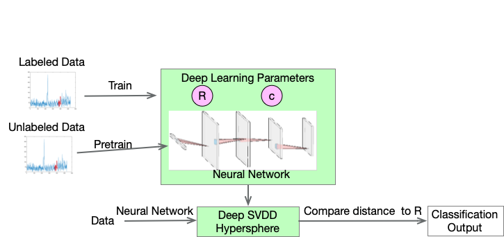

# DeepSVDD-Pytorch-4-HRRP-Radar-Target-Recognition
Pytorch实现的基于SVDD的一维高分辨率雷达距离像目标识别

Target recognition of one-dimensional high-resolution radar range profile based on SVDD realized by pytorch

## 参考
本代码基于[工程](https://github.com/lukasruff/Deep-SVDD-PyTorch).
## 论文
展示结束，论文链接：https://ieeexplore.ieee.org/document/9624499

    @INPROCEEDINGS{9624499,  
        author={Sun, Lin and Liu, Jianpo and Liu, Yuanqing and Li, Baoqing},  
        booktitle={2021 International Conference on Control, Automation and Information Sciences (ICCAIS)},   
        title={HRRP Target Recognition Based On Soft-Boundary Deep SVDD With LSTM},   
        year={2021},  
        volume={},  
        number={},  
        pages={1047-1052},  
        doi={10.1109/ICCAIS52680.2021.9624499}
        }
## IDEA


## 运行指令
```bash
cd SVDD-Pytorch-4-HRRP-Radar-Target-Recognition
python trainer.py -b /root/svdd_torch/seafood_svdd -c config/config_default.yaml -m test
```
指令介绍：
- -b 工作路径
- -c 配置文件路径
- -m 本次调制名称（模型命名）
- -c （如果有的话）选择checkpoint模型


